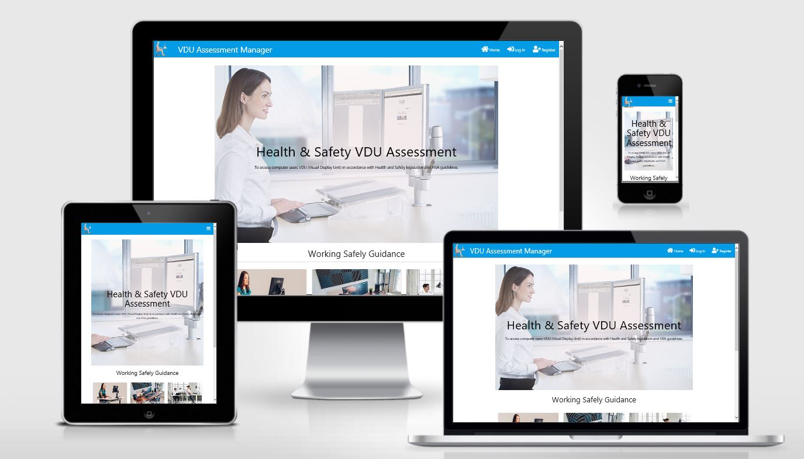
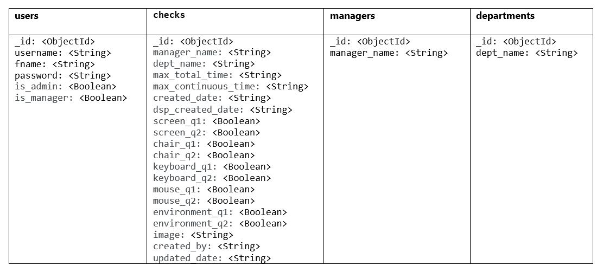

<h1 align="center">VDU Assessment Manager</h1>

[View the live project here.](https://vdu-assessment.herokuapp.com/)

<h2 align="center"></h2>

The VDU Assessment Manager is an online application that allows user to complete & submit their VDU (Visual Display Unit) Assessment.  Assessments will be categorised per user submission for further analysis and follow up by Accessor.

Under the Safety, Health and Welfare at Work, (General Application) Regulations 2007, Chapter 5 of Part 2 outlines the requirements that must be adhered to in relation to Display Screen Equipment.

  #### What constitutes a workstation under the Display Screen Equipment Regulation 2007 ?
 
 “workstation” means an assembly comprising display screen equipment, which may be provided with a keyboard or input device or software, or a combination of the foregoing, determining the operator and machine interface, and includes—
- #####  a work chair and work desk or work surface,
- #####  any optional accessories and peripherals, and
- #####  the immediate work environment of the display screen   equipment.

# User Experience (UX)

-   ## Goals

    -   ### Visitor Goals

        The central target audience for VDU Assessment Manager are:
        - All Employees
        - All Contactors 
 
       User Goals are:
      - Register / Login to VDU Assessment Manager
      - Complete my VDU Assessment
      - View Completed VDU Assessments
      - Edit my Completed VDU Assessments
      - Delete my Completed VDU Assessments

      Manager Goals are:
     - Register / Login to VDU Assessment Manager
     - View my reports VDU Assessments

      Admin Goals are:
     - Register / Login to VDU Assessment Manager
     - Access Maintenance Section to maintain Department and Manager Dropdowns
     - Access Maintenance Section to maintain is_admin & is_manager rights
        
    Business Goals are:
      - Provide a repository to gather Employee and Contractor VDU feedback for further assessment
     
-   ## User Stories
  
      - ### Visitor Stories
  
      As a visitor to VDU Assessment Manager I expect:
      
    1. To easily find what I am looking for, I want the layout of the site to make sense so I am not confused or put off using it.

    2. The information I am presented with to be laid out in a way that is easy for me to navigate, so that I find what I need quickly and efficiently.

    - ### Business Stories

      As a Business using VDU Manager I expect:

    1. To easily find what I am looking for, I want the layout of the site to make sense so I am not confused or put off using it.

    2. The information I am presented with to be laid out in a way that is easy for me to navigate, so that I find what I need quickly and efficiently.

-   ## Design Choices
  
      -   ### Colour Scheme
        - There is alot of whitespace in the application, the whitespace draws attention and attracts the user to 
           the eyecatching buttons and good quality images
    
      -   ### Imagery 
         - I selected images that are relevant to the content of the application.   The icon in the navbar has an orange seat, 
            and the buttons on the home page are orange.  This small detail improves the asthetics of the application
        
      
      
      -   ### Icons 
        -  The icon in the navbar is a good fit for the theme of the application
        -  Icons break up the information visually, creating space for the user and not overwhelming them with too much info at once.
        -  Each icon was chosen for it's clarity in quickly explaining the relevant meaning with an image.

-   ## Wireframes
    
    These wireframes were created using Balsamiq during the Scope Plane part of the design and planning process for this project.

    -   Home Page Wireframe - [View](Wireframes/HomePage.pdf)
    
    
    
# Features

-   ## Navbar

    The navigation bar features the VDU Assessment Manager logo in the top left corner.

    For visitors to the site who are not logged in, 'Working Safely Guidance' liks are available for them to use on the Homepage.  Also the following links in the Navbar

       - Home
       - Log in
       - Register

    For users who are logged in the Create & View Assessment buttons will be available, the NavBar items are as follows:
       
       - Home
       - Log Out
       - Profile

    
    Python determines if the user is logged in or not by checking if 'user' in session and passes this data to Jinja to display the correct navbar for the user.

    The navbar is collapsed into a burger icon on small screens. On the activities page, where the activities filter takes up some of the width of the screen, the navbar is        collapsed on medium screens as well, so that menu items did not start overlapping content.

    The practical design choice was made not to fix the navbar to the top of the page as the user

-   ## Footer

    The footer is grey a differenct colour to the Navbar, is very simple with only Copyright text and also a useful feature of displaying the name of the user logged in

-   ## Home Page 

    ### Hero Image
    The Hero image of a professional woman standing at her PC.  The womans desk is an good example of good ergonomics.  The applicaiton title and sub-heading accoss the hero         image is important for User knowledge & Guidance.  Once User is signed in the Create & View Asssesments buttons are available
    
     ### Working Safely Guidance Cards
    Each Working Safely Guidance card on the home page gives the user brief and useful information about each of the listings displayed. The 'read more' button brings the         User to a Modal Form with more detail on the topic

-   ## Registration Page
     - The register page allows user's to create a new account. The user is asked to fill the fields "username","firstname","password" and "confirm password". When adding a             username, the code compares it against existing usernames to ensure that it is unique. A username must be 3-15 characters long. 
     - The password field is a required field. The "confirm password" field must match the original password. All passwords are hashed for security purposes. If user's         input does not meet requirements, flash messages will inform a user about the error. When the form is submitted successfully, a user is redirected to the home page and           informed that account was created. There is also a link to the login page for existing users at the bottom of the Registration form.
    
-   ## Login Page
     - The login page contains the form with "username" and "password" fields, allowing registered users to log into their account. If the entered username and hashed       password          match the ones in the database, a user is redirected to the home page and informed that the login was successful. Otherwise, flash messages will be displayed about              incorrect user's input. There is also a link to the register page for new users at the bottom of the form.

-   ## Logout

    Clicking on the "logout" button by the logged in users ends their session and redirects to the Login page.
    
-   ## Create Assessments

    Clicking on the "Create Assessments" button on the Homepage allows the User to create a new VDU Assessment

-   ## View Assessments

    Clicking on the "View Assessments" button on the Homepage brings the User to page where they can view all their completed assessments
    
    ### Edit Assessments 

    Fron the View Assessment page the User can Edit their existing assessments.  Assessments are only visible to person created by.  The Assessment form will be pre-populated     with the original Assessment details. After clicking "Edit Assessment" button, the Assessment is updated in the database and a user is redirected to their Assessments         Page.
     There is also a Cancel button that redirects the User to the their Assessmments page

    ### Delete Assessment

    The delete Assessment function allows only the created by person to delete Assessment. After a user clicks the "delete" button, the delete modal will be triggered. The       User will be prompted to Confirm the deletion, there is an option to cancel the deletion or click Yes to permantly remove Assessment from the database

- ## User Profile Page
     When the User selects Profile Option in the Navbar, they can view their profile.  The profile page consists of the persons firstname & Username Displayed.  Depending on      the Users level of access they following three options may be available -
     
   ### Change Password

    This button will be available to all users.  A user can change their current password by filling the form that contains following fields:  "New password", "Confirm New       password". Both new password need to match. There is a question mark that displays requirements for the field when hovered over. If the form is successfully submitted, a      user is redirected back to Profile Page with a flash message detailing successfully changed password. There is also a button "Cancel" that redirects User to Profile Page
 
   ### Your Reports Assessment

    This button will only be available users that have been assigned the Manager role.  In the 'View Reports Assessment' page managers can view their reports Assessments.         Only the Assessments that the User is assigned as Manager in the database will be displayed, by limiting the find to Manager in Python.  The Manager also has the option       to search by Username, displaying all assessments created by particular username

  ### Maintenance

    This button will only be available users that have been assigned the Admin role.  This button has a dropdown of three options - 
    
    - Manager Maintenace
    - Department Maintenace
    - User Maintenace
    
    #### - Manager Maintenace
    In Manager Maintenance the Admin person is responsible for the updating of the list of Managers available in dropdown to the User creating VDU Assessment. The Admin can        Edit the Records.  The Admin User can also delete a Manager.  After clicking the "delete" button, the delete modal will be triggered. The User will be      prompted to Confirm the deletion, there is an option to cancel the deletion or click Yes to permantly remove Manager from the database
    
    #### - Department Maintenace
    In Department Maintenance the Admin person is responsible for the updating of the list of Department available in dropdown to the User creating VDU Assessment. The Admin       can Edit the Records.  The Admin User can also delete a Department.  After clicking the "delete" button, the delete modal will be triggered. The User will be prompted        to Confirm the deletion, there is an option to cancel the deletion or click Yes to permantly remove Department from the database
    
    #### - User Maintenace
    In User Maintenance the Admin person can assign / unassign Manager and Admin privliges. The Admin User can also delete a User.  After clicking the "delete" button, the   delete modal will be triggered. The User will be prompted to Confirm the deletion, there is an option to cancel the deletion or click Yes to permantly remove User from the database
    
# Validators

## Html

All the HTML files were tested through W3C Markup Validation Service. I used the 'view page source' option, since W3C Markup Validation Service does not recognize Jinja2 templating language.  I was able to correct all findings.

## CSS

CSS files were tested through W3C CSS Validation Service. I was able to correct all findings.

## JavaScript

Script files were tested through W3C CSS Validation Service. I was able to correct all findings.

## Python

All python files were tested through PEP8 Online validator.  I was able to correct all findings.

# Compatibility and Responsiveness

 I used the Google Chrome's developer tools to see how it looks across all the different device screen sizes to ensure compatibility and responsiveness.
 I also used Am I Responsive online tool for checking responsiveness on different devices.
 
# Technology Used
 - GitPod - an online IDE for developing this project.
 - Git - for version control.
 - GitHub - for remotely storing project's code.
 - PIP - for installation of necessary tools.
 - GIMP2 - for editing VDU logo.
 - Am I Responsive - for creation of the images in the readme file and checking responsiveness.
 - Flickr - to host Workstation images

 ## Front-End
 - HTML - to build the foundation of the project.
 - CSS - to create custom styles.

## Back-End
 - Python 3.8.2 - back-end programming language used in this project.
 - Flask 1.1.2 - microframework for building and rendering pages.
 - MongoDB Atlas - NoSQL database for storing back-end data.
 - PyMongo - for Python to get access the MongoDB database.
 - WTForms 2.2.1 - for creating forms with validation.
 - Werkzeug 0.16.1 - to generate and verify password hashing.
 - Jinja 2.10.1 - templating language for Python, to display back-end data in HTML.
 - Heroku - to host the project.

### Languages Used

-   [HTML5](https://en.wikipedia.org/wiki/HTML5)
-   [CSS3](https://en.wikipedia.org/wiki/Cascading_Style_Sheets)
-   [JavaScript](https://www.javascript.com/)
-   [jQuery](https://jqueryui.com)

## Libraries
- Materialize 1.0.0 - main responsive modern front-end framework used for grid and responsivesness.
- Google Fonts - to import fonts.
- FontAwesome - to provide icons used across the project.

# Deployment

## Local Deployment

To run this project, the following tools need to be installed:
 - An IDE (I used GitPod online IDE for creating this project)
 - MongoDB Atlas (for creation your database)
 - Git
 - PIP
 - Python

### Directions

 - 1.You can clone this repository directly into the editor of your choice by pasting the following command into the terminal:
    git clone https://github.com/bridcourtney/VDU-Assessment.  Alternatively, you can save a copy of this repository by clicking the green button "Clone or download" , then      "Download Zip" button, and after extract the Zip file to your folder.
    
 - 2.In the terminal window change directory (CD) to the correct file location (directory that you have just created).
 
 - 3.Set up environment variables: ◦Create .env file in the root directory.  On the top of the file add import os to set the environment variables in the operating system.
    Set the connection to your MongoDB database(MONGO_URI) and a SECRET_KEY with the following syntax: os.environ["SECRET_KEY"] = "YourSecretKey" os.environ["MONGO_URI"] =       "YourMongoURI"
    
 - 4.Install all requirements from the requirements.txt file putting this command into your terminal: pip3 install -r requirements.txt
    Note: GitPod does not require sudo, so if you use another IDE, you will need to include sudo in the beginning of the command: sudo pip3 install -r requirements.txt.
    
 - 5.Create a new Database called "vdu_check" in MongoDB Atlas.  You can sign up for free account, if you do not have one.
 
 - 6.In "vdu_check" database create the 4 collections below.  Once the collections are created you can run the application using the following command python3 run.py.

<h2 align="center"></h2>

## Branching

## Credits

### Code

-   [Bootstrap4](https://getbootstrap.com/docs/4.4/getting-started/introduction/): Bootstrap Library used throughout the project mainly     to make site responsive using the Bootstrap Grid System.

-   The Navbar code was taken from https://www.w3schools.com/bootstrap4/bootstrap_navbar.asp, and taylored to meet my requirements
-   The Carousal code was taken from https://azmind.com/bootstrap-carousel-multiple-items/
-   Geocode API https://developers.google.com/maps/documentation/javascript/examples/geocoding-reverse#maps_geocoding_reverse-javascript)
-   Places API https://developers.google.com/maps/documentation/javascript/examples/places-autocomplete-hotelsearch#maps_places_autocomplete_hotelsearch-javascript

### Content

-   All content was written by the developer.

 
### Acknowledgements

-   My Mentor Brian Macharia for continuous helpful feedback, excellent support material and very productive mentoring sessions

-   Tutor support at Code Institute for their support.
